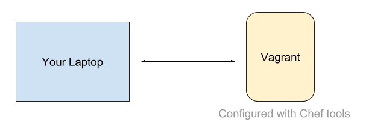

# Sous-Chef
> just my personal cookbook collection

I used a virtual workstation that I setup with vagrant and virtualbox.



## Installation
You need `vagrant` 

Vagrant
- https://www.vagrantup.com/docs/installation/

>box comes with chef pre-installed

check it out: [edmamerto/bento-ubuntu-16.04-chef](https://app.vagrantup.com/edmamerto/boxes/bento-ubuntu-16.04-chef)

## Development setup

Bring up node (ubuntu in this example)

```bash
$ vagrant up
```
Enter node
```bash
$ vagrant ssh
```

## License
Copyright © Ed Mamerto.
